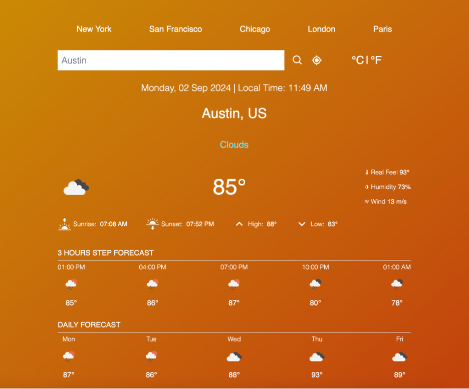

# Weather Forecast App
Weather Forecasting Application created by [Minjae Jang](https://minjae21.github.io/index.html)

## How It's Made:
- **React**: The structure of the application is defined using React.

- **CSS**: The appearance and basic layout of the app (Tailwind CSS)

- **JavaScript**: The app logic and interactivity are implemented using JavaScript.

## Features:
**1. Real-time Weather Updates**
  - Get the most up-to-date weather information for your location or any other city worldwide.
  - Weather data includes temperature, humidity, and wind speed.

**2. 7-Day 3-Hour Forecast**
  - View a comprehensive 7-day and 3-hour weather forecast.
  - Detailed daily information on temperature highs and lows, and other detailed weather conditions.

**3. Location-based Forecasting**
  - A feature to detect your current location for instant weather updates.
  - Search for weather information in any city or region globally.

**4. Temperature Unit Conversion**
  - Easily switch between Celsius and Fahrenheit for temperature display.
  - Supports conversion for all temperature readings, including current, and forecast data.

